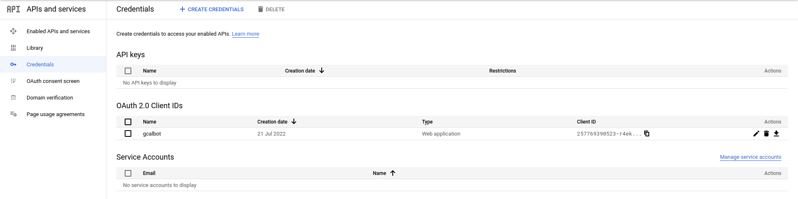
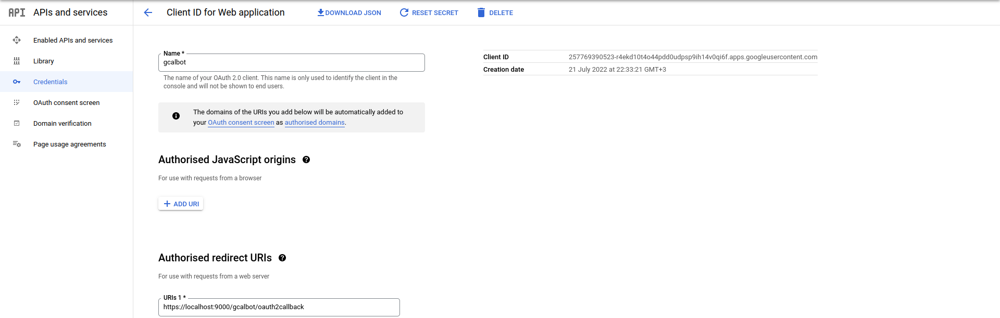
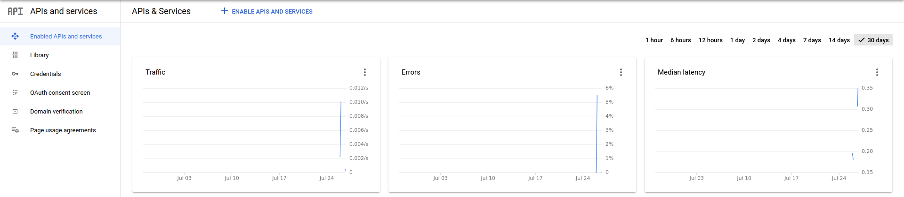

# Introduction
Bot allows to share Google Calendar with other users. The purpose is to make the process simple for users who have only mobile devices at hand.
# Installation
The process consists of 3 parts: Telegram deployment, Google API deploymant and bot code deployment.
## Telegram deployment
1. Talk to [BotFather](https://t.me/botfather) to obtain bot API key.
1. Modify bot help for the target language. List of commands can be obtained from [tg_messages.py](engine/tg/tg_messages.py).
## Google API deployment
1. Go to [GCP Console](https://console.cloud.google.com)
1. Create a new project or select and existing one
1. Create a new set of [OAuth2.0](https://console.cloud.google.com/apis/credentials). 

    
    
1. Add authorized redirect URIs to OAuth2.0 credentials

    

1. Enable Calendar API

   
   
## Bot code deployment
1. Copy the most up-to-date code to the host
    ```shell
    $ git clone https://github.com/braonle/gcalbot.git
    $ cd gcalbot
    $ python3 -m venv venv
    $ source venv/bin/activate
    $ pip install pip --upgrade
    $ pip install -r requirements.txt
    ```
1. Fill out the necessary parameters in [engine/global_params.py](#bot-parameters)
1. Initialize SQLite3 DB file
    ```shell
    $ cd engine/sqlite
    $ sqlite3 gcalbot.sqlite3 < gcalbot.schema
    ```
1. Create systemd entry is you want automatic bot startup on system boot
    ```shell
    $ cat gcalbot.service 
    [Unit]
    Description=Telegram bot (gcalbot)
    After=multi-user.target
    
    [Service]
    Type=simple
    WorkingDirectory=/home/user/iaroslav/git/gcalbot
    Restart=always
    ExecStart=/home/user/iaroslav/git/gcalbot/venv/bin/python /home/user/iaroslav/git/gcalbot/main.py
    
    [Install]
    WantedBy=multi-user.target

    ```
1. Enable gcalbot
    ```shell
    $ systemctl daemon-reload
    $ systemctl enable oubot
    $ systemctl start oubot
    ```

## Bot parameters
### Global
* **DEBUG**: disables notifying all chats on startup/shutdown events
* **POLLING_BASED**: toggles webhook or polling Telegram to retrieve messages
### Bot
* **TOKEN**: API token obtained from [BotFather](https://t.me/botfather)
### SQLite3
* **DB_NAME**: path to SQLite DB file created from oubot.schema [in advance](#bot-code-deployment), relative to working directory
### Polling
* **POLL_INTERVAL**: how often bot polls Telegram, seconds
### Webhook
* **DNS_NAME**: public URL that can be used for webhook callback 
* **LISTEN_IP**: physical IP address to start listener on (e.g. private NAT IP), can be *0.0.0.0*   
* **PRIVATE_KEY**: path to certificate private key, relative to working directory  
* **CERTIFICATE**: path to certificate, relative to working directory
### Telegram webhook
* **TG_PORT**: TCP port Telegram listener acquires from OS; without proxy it has to be 80, 443 or 8443 
### Uvicorn parameters
* **UVICORN_PORT**: TCP port uvicorn listener acquires from OS
### Google API
* **CLIENT_SECRET**: path to Google API application credentials (e.g. credentials.json)
* **REDIRECT_URL**: URL used to obtain authorization grant code from Google; can be left by default if no proxy is used

# Commands
All commands are available directly, although using inline button keyboard is recommended
* **/start**: invoke inline keyboard menu or generate Google Calendar authorization link
* **/help**: list available commands and their description
* **/show_calendars**: prints available calendars
* **/show_share \<calendar\>**: show users who have access to the specified calendar
* **/add_share \<calendar\> \<e-mail\> \<role\>**: user is granted access to calendar
* **/delete_share \<calendar\> \<e-mail\>**: user's access to calendar is revoked

# Reverse proxy
If there are several bots running on a single host, it might be worthwhile to run them on different ports behind reverse proxy.
## NGINX configuration
```shell
$ cat /etc/nginx/sites-enabled/bot_proxy 
server {
        location /gcalbot/tg/ {
                proxy_pass https://localhost:8444/;
                proxy_set_header Host $host;
                proxy_set_header X-Real-IP $remote_addr;
        }

        location /gcalbot/callback/ {
                proxy_pass https://localhost:9000/;
                proxy_set_header Host $host;
                proxy_set_header X-Real-IP $remote_addr;
        }
}
```
## Bot configuration
By default, bot expects to be run exclusively on a host. Change the following lines in [tg_handlers.py](engine/tg/tg_handlers.py) from
```python
if global_params.POLLING_BASED:
    updater.start_polling(poll_interval=global_params.POLL_INTERVAL)
else:
    updater.start_webhook(listen=global_params.LISTEN_IP, port=global_params.PORT, url_path=global_params.TOKEN,
                      key=global_params.PRIVATE_KEY, cert=global_params.CERTIFICATE,
                      webhook_url=f'https://{global_params.PUBLIC_IP}:{global_params.PORT}/{global_params.TOKEN}')
```
to
```python
    if global_params.POLLING_BASED:
        updater.start_polling(poll_interval=global_params.POLL_INTERVAL)
    else:
        updater.start_webhook(listen=global_params.LISTEN_IP, port=global_params.TG_PORT, url_path=global_params.TOKEN,
                          key=global_params.PRIVATE_KEY, cert=global_params.CERTIFICATE,
                          webhook_url=f'https://{global_params.DNS_NAME}/gcalbot/tg/{global_params.TOKEN}')

```